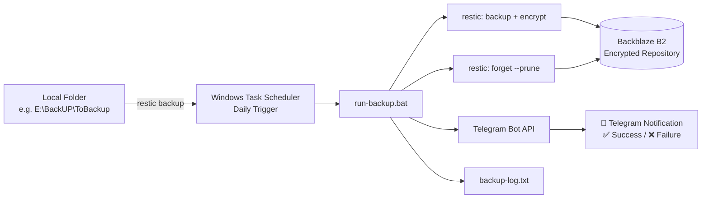

# 🔐 Automated Backup Pipeline for Windows

> A zero-cost, encrypted, scheduled backup system for personal files — built with `restic`, Backblaze B2, Windows Task Scheduler, and Telegram notifications.


---

## 📖 Overview

Losing important files — documents, photos, personal projects — to a dead hard drive, an accidental deletion, or a stolen laptop is one of the most common and preventable disasters in daily computing. This project solves that problem end-to-end, for free, without requiring any server infrastructure.

It runs entirely on a personal Windows laptop and automatically:

1. **Backs up** a designated folder to encrypted cloud storage every day
2. **Prunes old snapshots** so storage never grows unbounded
3. **Notifies you on Telegram** whether the backup succeeded or failed
4. Can be **restored from any device**, as long as you have the encryption password

No always-on server. No paid subscription. No manual babysitting.

---

## 📑 Table of Contents

- [Features](#-features)
- [Architecture](#-architecture)
- [Tech Stack](#-tech-stack)
- [Prerequisites](#-prerequisites)
- [Installation](#-installation)
- [Configuration](#-configuration)
- [Usage](#-usage)
- [Retention Policy](#-retention-policy)
- [Restore Guide](#-restore-guide)
- [Troubleshooting](#-troubleshooting)
- [Security Notes](#-security-notes)
- [Roadmap](#-roadmap)
- [License](#-license)

---

## ✨ Features

- 🔒 **Client-side encryption** — data is encrypted before it ever leaves your machine (restic + AES-256)
- ☁️ **Free cloud storage** — uses Backblaze B2's free tier (10 GB, no credit card required)
- ⏰ **Fully automated** — runs daily via Windows Task Scheduler, no manual trigger needed
- 🧹 **Automatic pruning** — old snapshots are cleaned up on a retention schedule, keeping storage usage predictable
- 📲 **Real-time alerts** — a Telegram bot messages you ✅ on success or ❌ on failure, no need to check logs manually
- 🪶 **No admin rights required** — works entirely with a standard user account, no elevated privileges needed
- 🧾 **Full audit log** — every run is timestamped and logged locally
- 🔁 **Restorable from any machine** — the backup repository lives in the cloud, decoupled from any single device

---

## 🏗 Architecture



**Flow summary:**

1. Task Scheduler triggers `run-backup.bat` daily at a fixed time
2. The script loads credentials, runs `restic backup`, then `restic forget --prune` for retention
3. Result is logged locally and pushed to Telegram as a notification
4. Data at rest in Backblaze B2 is fully encrypted — even Backblaze cannot read it

---

## 🧰 Tech Stack

| Component     | Tool                                                 | Why                                                                                  |
| ------------- | ---------------------------------------------------- | ------------------------------------------------------------------------------------ |
| Backup engine | [restic](https://restic.net/)                           | Open-source, encrypted, deduplicated, cross-platform CLI backup tool                 |
| Cloud storage | [Backblaze B2](https://www.backblaze.com/cloud-storage) | Generous free tier, S3-compatible, no credit card needed to start                    |
| Scheduler     | Windows Task Scheduler (`schtasks`)                | Native to Windows, no extra install, no admin rights required                        |
| Notifications | [Telegram Bot API](https://core.telegram.org/bots/api)  | Free, instant, works from any device with the Telegram app                           |
| Automation    | Batch script (`.bat`)                              | Avoids PowerShell Execution Policy restrictions common on managed/corporate machines |

---

## ✅ Prerequisites

- Windows 10/11
- A [Backblaze B2](https://www.backblaze.com/sign-up/cloud-storage) account (free, no credit card)
- A [Telegram](https://telegram.org/) account
- `restic` binary ([download here](https://github.com/restic/restic/releases))
- `curl` (built into Windows 10/11 by default)

---

## 🚀 Installation

### 1. Install restic

Download the latest Windows release and extract it:

```powershell
Invoke-WebRequest -Uri "https://github.com/restic/restic/releases/latest/download/restic_<VERSION>_windows_amd64.zip" -OutFile "$env:TEMP\restic.zip"
Expand-Archive -Path "$env:TEMP\restic.zip" -DestinationPath "E:\BackUP\bin" -Force
```

Rename the extracted `.exe` to `restic.exe`. Verify it works:

```powershell
E:\BackUP\bin\restic.exe version
```

> 💡 If your organization's Group Policy blocks `winget` installs or PowerShell script execution, this manual method sidesteps both issues entirely.

### 2. Create a Backblaze B2 bucket

- Sign up at Backblaze → **B2 Cloud Storage** → **Create a Bucket**
- Set visibility to **Private**
- Go to **Application Keys** → **Add a New Application Key**
- Save the generated `keyID` and `applicationKey` — they're shown only once

### 3. Create a Telegram bot

- Message [@BotFather](https://t.me/BotFather) on Telegram → `/newbot`
- Follow the prompts to get a **bot token**
- Start a chat with your new bot, then fetch your chat ID:
  ```
  https://api.telegram.org/bot<YOUR_BOT_TOKEN>/getUpdates
  ```

  Look for `"chat":{"id": ...}` in the response.

### 4. Initialize the restic repository

```powershell
$env:B2_ACCOUNT_ID = "<YOUR_B2_KEY_ID>"
$env:B2_ACCOUNT_KEY = "<YOUR_B2_APPLICATION_KEY>"
$env:RESTIC_REPOSITORY = "b2:<YOUR_BUCKET_NAME>:laptop"
$env:RESTIC_PASSWORD = "<YOUR_STRONG_ENCRYPTION_PASSWORD>"

E:\BackUP\bin\restic.exe init
```

---

## ⚙️ Configuration

Create `E:\BackUP\backup.env.txt` with your credentials. **This file is never committed to the repository** — see [`.gitignore`](#-security-notes) below.

```env
B2_ACCOUNT_ID=<YOUR_B2_KEY_ID>
B2_ACCOUNT_KEY=<YOUR_B2_APPLICATION_KEY>
RESTIC_REPOSITORY=b2:<YOUR_BUCKET_NAME>:laptop
RESTIC_PASSWORD=<YOUR_STRONG_ENCRYPTION_PASSWORD>
TG_TOKEN=<YOUR_TELEGRAM_BOT_TOKEN>
TG_CHATID=<YOUR_TELEGRAM_CHAT_ID>
```

> ⚠️ **Format rules:** no quotes, no spaces around `=`. The password should avoid special characters like `!`, `|`, `&`, `^`, `<`, `>`, `%` since the script is a `.bat` file and these characters have special meaning in `cmd.exe`.

The backup script (`run-backup.bat`):

```bat
@echo off
setlocal enabledelayedexpansion

set RESTIC_EXE=E:\BackUP\bin\restic.exe
set ENV_FILE=E:\BackUP\backup.env.txt
set BACKUP_PATH=E:\BackUP\ToBackup
set LOG_FILE=E:\BackUP\backup-log.txt

for /f "usebackq tokens=1,2 delims==" %%A in ("%ENV_FILE%") do (
    set "%%A=%%B"
)

echo [%date% %time%] Backup started >> "%LOG_FILE%"

"%RESTIC_EXE%" backup "%BACKUP_PATH%" >> "%LOG_FILE%" 2>&1

if %ERRORLEVEL% EQU 0 (
    echo [%date% %time%] Backup SUCCESS >> "%LOG_FILE%"
    curl -s -X POST "https://api.telegram.org/bot%TG_TOKEN%/sendMessage" -d "chat_id=%TG_CHATID%" -d "text=✅ Laptop backup SUCCESS - %date% %time%" >nul
) else (
    echo [%date% %time%] Backup FAILED - error code %ERRORLEVEL% >> "%LOG_FILE%"
    curl -s -X POST "https://api.telegram.org/bot%TG_TOKEN%/sendMessage" -d "chat_id=%TG_CHATID%" -d "text=❌ Laptop backup FAILED code %ERRORLEVEL% - check E:\BackUP\backup-log.txt" >nul
)

"%RESTIC_EXE%" forget --keep-daily 7 --keep-weekly 4 --keep-monthly 6 --prune >> "%LOG_FILE%" 2>&1

echo [%date% %time%] Done >> "%LOG_FILE%"
echo ---------------------------------------- >> "%LOG_FILE%"

endlocal
```

---

## ▶️ Usage

### Run a backup manually

```powershell
E:\BackUP\run-backup.bat
```

### View recent log entries

```powershell
Get-Content "E:\BackUP\backup-log.txt" -Tail 20
```

### Schedule daily automatic backups

```powershell
schtasks /Create /TN "AutoBackup" /TR "E:\BackUP\run-backup.bat" /SC DAILY /ST 22:00
```

### Manage the scheduled task

| Action          | Command                                        |
| --------------- | ---------------------------------------------- |
| Run immediately | `schtasks /Run /TN "AutoBackup"`             |
| Pause           | `schtasks /Change /TN "AutoBackup" /Disable` |
| Resume          | `schtasks /Change /TN "AutoBackup" /Enable`  |
| Remove entirely | `schtasks /Delete /TN "AutoBackup" /F`       |
| Check status    | `schtasks /Query /TN "AutoBackup"`           |

Or manage visually via `taskschd.msc`.

---

## 🧹 Retention Policy

To prevent unbounded storage growth on the free tier, every run prunes old snapshots according to:

```
--keep-daily 7    → last 7 daily snapshots
--keep-weekly 4   → last 4 weekly snapshots
--keep-monthly 6  → last 6 monthly snapshots
```

This means you always have granular recent history (last week, day by day) while older history thins out automatically — a standard [grandfather-father-son](https://en.wikipedia.org/wiki/Backup_rotation_scheme) rotation pattern, without manual cleanup.

---

## 🆘 Restore Guide

**Step 1 — Load credentials**

```powershell
Get-Content "E:\BackUP\backup.env.txt" | ForEach-Object {
    $name, $value = $_ -split '=', 2
    Set-Item -Path "Env:$($name.Trim())" -Value $value.Trim().Trim('"')
}
```

**Step 2 — List available snapshots**

```powershell
E:\BackUP\bin\restic.exe snapshots
```

**Step 3 — Restore to a safe location** (never restore directly over live data)

```powershell
E:\BackUP\bin\restic.exe restore latest --target "E:\RESTORE-TEMP"
```

**Step 4 — Verify integrity** before moving restored files into place. Open a few files manually to confirm they aren't corrupted.

> 🖥️ **Restoring on a brand new machine?** The repository lives in the cloud, not on any single device. Install restic, recreate `backup.env.txt` from your securely-stored credential backup, and run the same restore steps — no dependency on the original laptop.

---

## 🐛 Troubleshooting

| Symptom                                                      | Cause                                                                               | Fix                                                                                     |
| ------------------------------------------------------------ | ----------------------------------------------------------------------------------- | --------------------------------------------------------------------------------------- |
| `restic` not recognized                                    | PATH not refreshed after install                                                    | Always call the full path:`E:\BackUP\bin\restic.exe`                                  |
| `.ps1` script blocked                                      | Execution Policy restriction (common on managed devices)                            | Use `.bat` scripts instead — not subject to PowerShell's Execution Policy            |
| Symlink restore errors (`My Music`, `My Pictures`, etc.) | Windows requires elevated privilege to recreate symlinks                            | Exclude these junctions from backup — the real folders are already backed up directly  |
| `wrong password or no key found`                           | Password contains shell-special characters (`!`, `\|`, etc.) misread by `.bat` | Use a password with only letters, numbers,`-`, `_`, `.`                           |
| No Telegram notification                                     | Bot not started, or no internet at run time                                         | Confirm you've sent `/start` to the bot; check `backup-log.txt` directly if offline |

---

## 🔒 Security Notes

- **Never commit `backup.env.txt`** — add it to `.gitignore`:
  ```gitignore
  backup.env.txt
  backup-log.txt
  restore-test/
  bin/
  ```
- Rotate your B2 application key and Telegram bot token immediately if they are ever pasted into a chat, screenshot, terminal recording, or public repository.
- Store your `RESTIC_PASSWORD` in a password manager. **If it's lost, the backed-up data is permanently unrecoverable — even Backblaze cannot help.**
- Consider keeping a physical, offline copy of the encryption password as a last-resort recovery option.

---

## 🗺 Roadmap

- [ ] Add email fallback notification for when Telegram is unreachable
- [ ] Support multiple source folders with per-folder retention rules
- [ ] Add a lightweight status dashboard (e.g. via Uptime Kuma push monitor)
- [ ] Cross-platform version using a shell script for macOS/Linux
- [ ] Weekly automated restore-test to catch silent corruption early

---

## 📄 License

MIT — free to use, modify, and adapt.

---

## 🙏 Acknowledgments

Built as a 7-day personal DevOps learning project — proof that meaningful, production-grade automation doesn't require a paid cloud budget, just the right free-tier tools stitched together thoughtfully.
